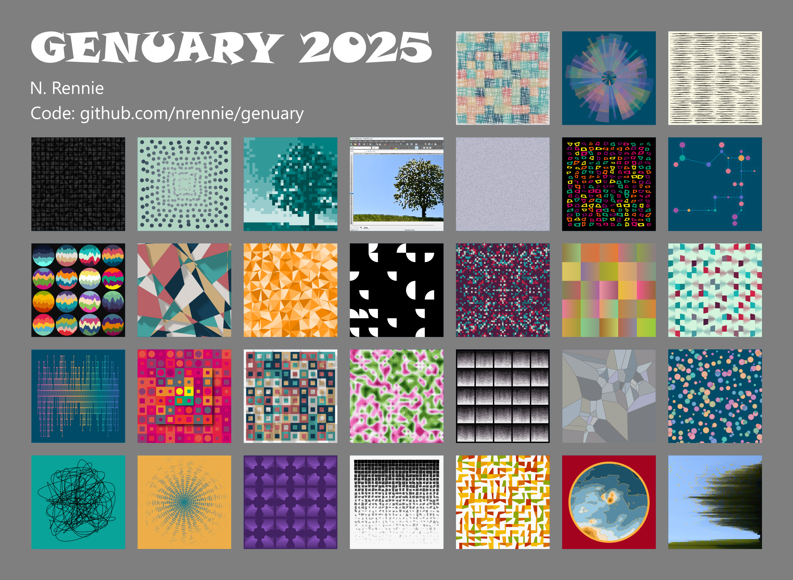
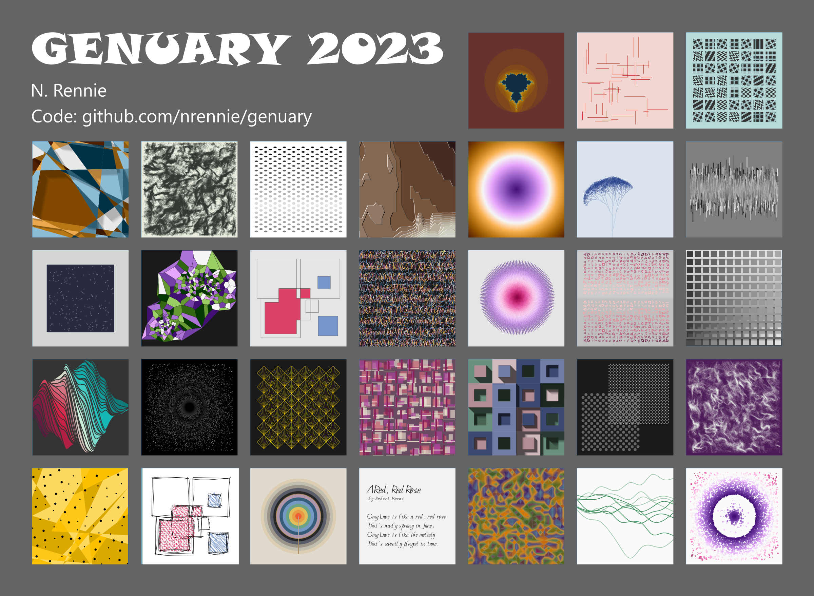
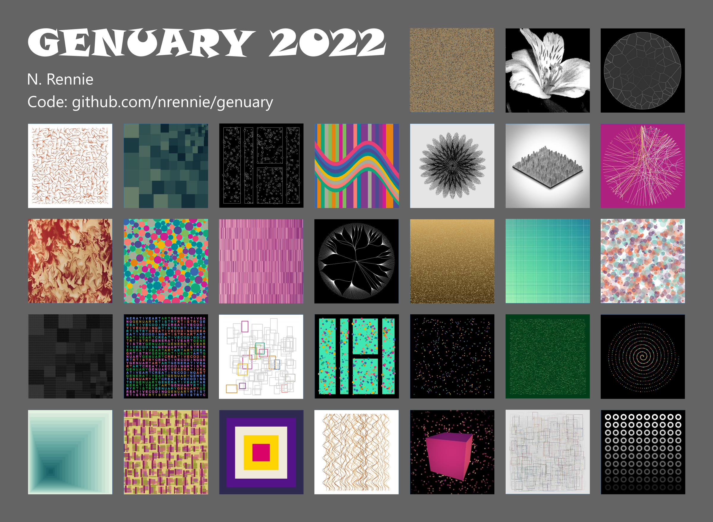

# GENUARY

GENUARY is an artificially generated month of time where we build code that makes beautiful things. It happens throughout January, and everybody is invited! There's a new prompt each day, and they can be found at [genuary.art](https://genuary.art/).

## 2025

  

## 2023

  

## 2022

  

